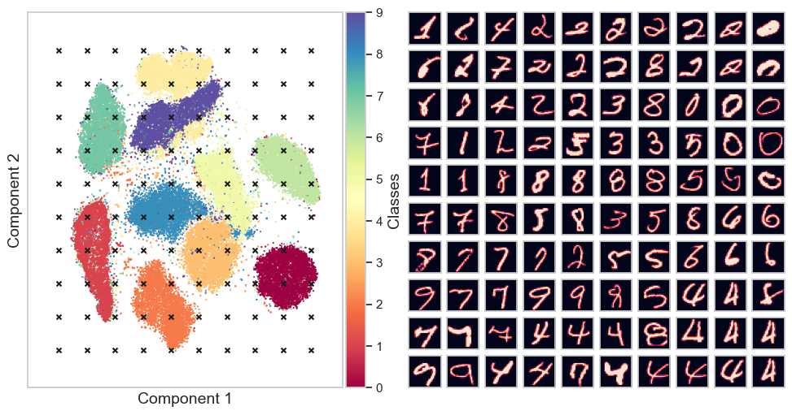
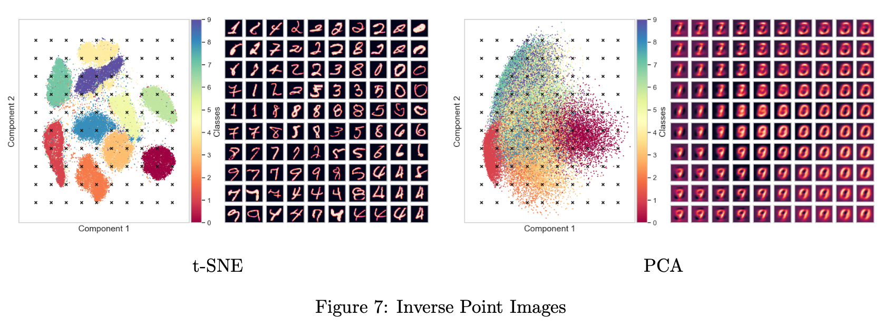
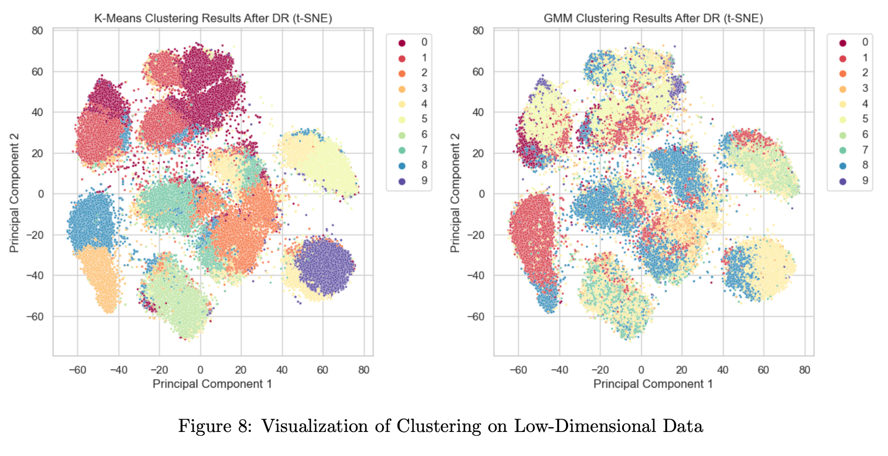
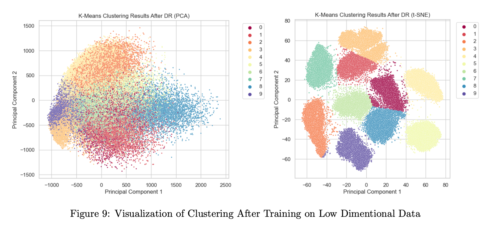
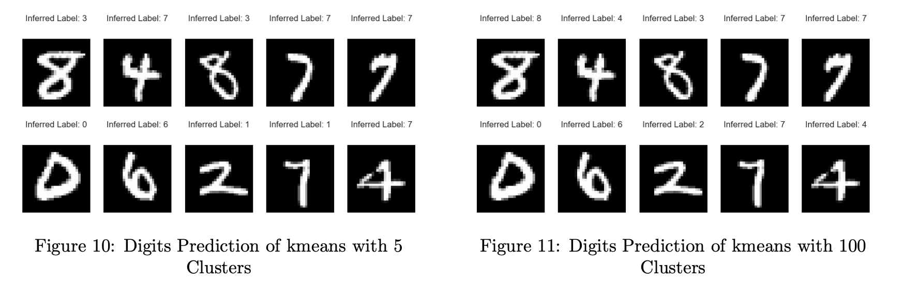

# Unsupervised Learning

Timot Baruch, Hadar Pur

Submitted as a project report for Advanced Machine Learning course, IDC, 2024

# Background, data exploration, and preprocessing

- **Dataset Overview:** The MNIST dataset comprises 70,000 images. Each image represents a single, centered, handwritten digit (0-9) and is size-normalized and grey-scaled. The images are presented as a 28x28 pixel grid, resulting in 784 features.

- **Size-Normalization and Centering:** During initial preprocessing, the dataset underwent size-normalization and centering to ensure uniformity in digit representations and simplify the learning process for machine learning models.

- **Train-Test Split:** The data was split into a training set and a test set, with the test set size set to 20% of the training set. Measures were taken to prevent overlapping writers between the two sets.

- **Data Standardization:** Despite applying StandardScaler to standardize dataset features with a mean of 0 and a standard deviation of 1, no significant enhancement in classifier performance or accuracy was observed. Consequently, the decision was made to proceed without scaling the data. Additionally, during Principal Component Analysis (PCA) for dimensionality reduction, the scaled data exhibited lower cumulative variance compared to unscaled data for a given number of components.

# Dimensionality reduction

We utilized various dimensionality reduction techniques to enhance the understanding of the MNIST dataset and visualize it in a 2-dimensional feature space. The following brief explanations outline each algorithm's role:

- **PCA (Principal Component Analysis):** PCA identifies the principal components that explain the maximum variance in the data, providing a linear projection to reduce dimensionality while retaining key information about the dataset's variability.

- **TSVD (Truncated Singular Value Decomposition):** TSVD decomposes the original data matrix into singular vectors and values, allowing for dimensionality reduction to capture dominant features and patterns in the data.

- **t-SNE (t-Distributed Stochastic Neighbor Embedding):** t-SNE is a nonlinear dimensionality reduction technique effective in revealing clusters and structures in the data while preserving pairwise similarities between data points.

- **UMAP (Uniform Manifold Approximation and Projection):** UMAP is a nonlinear dimensionality reduction method that preserves both local and global structures in high-dimensional data, capturing complex relationships within the dataset.

For all these techniques, default parameters were applied to obtain a baseline reduction, capturing essential patterns and structures within the data.

## Hyper-parameters Tuning On DR Methods

For the PCA and t-SNE methods, we conducted extensive hyperparameter testing to identify the most effective combination for optimizing performance. The key hyperparameters explored for each DR method are outlined below according to the DR used. The best run is highlighted in bold in each table.
\newline Due to exceptionally long running times, UMAP  testing was excluded from this phase of analysis. Also, TSVD provided unsatisfactory results in the visualization step, so it was excluded from this phase.

- **PCA:** he `n_components` parameter determines the number of principal components to retain. It influences the amount of variance retained in the reduced space. The `svd_solver` parameter, like 'randomized' or 'full', defines the algorithm used for singular value decomposition and impacts the computational efficiency.

| n_components | svd_solver | explained_variance | reconstruction_error |
|--------------|------------|--------------------|----------------------|
| 5            | auto       | 0.333790           | 2910.795606          |
| 5            | full       | 0.333790           | 2910.796008          |
| 5            | randomized | 0.333790           | 2910.796227          |
| 10           | auto       | 0.489385           | 2230.018559          |
| 10           | full       | 0.489385           | 2230.019752          |
| 10           | randomized | 0.489385           | 2230.018290          |
| 50           | auto       | 0.825549           | 765.217696           |
| 50           | full       | 0.825614           | 765.071916           |
| 50           | randomized | 0.825601           | 765.134985           |
| 100          | auto       | 0.914748           | 374.082438           |
| 100          | full       | 0.915059           | 373.083830           |
| 100          | randomized | 0.914669           | 374.453304           |
| 200          | auto       | 0.966205           | 148.766095           |
| **200**      | **full**   | **0.966587**       | **147.483888**       |
| 200          | randomized | 0.966184           | 148.949969           |

*Table 1: PCA Hyper-parameters tuning Results*

- **t-SNE:** The `n_components` parameter specifies the dimensionality of the embedded space. A lower value may capture global structures, while higher values might preserve more local relationships. The `learning_rate` influences the step size during optimization, affecting the convergence and final layout of the data in the low-dimensional space. The `perplexity` is a hyperparameter that balances the attention given to local and global aspects of the data. It is used to define the effective number of neighbors for each data point during the dimensionality reduction process. 

| n_components | perplexity | learning_rate | min_divergence |
|--------------|------------|---------------|----------------|
| 2            | 20         | 10            | 4.388708       |
| 2            | 20         | 200           | 3.163473       |
| 2            | 20         | auto          | 2.801678       |
| ...          | ...        | ...           | ...            |
| 2            | 150        | 10            | 2.298883       |
| 2            | 150        | 200           | 2.297647       |
| 2            | 150        | auto          | 2.156140       |
| 3            | 20         | 10            | 2.156140       |
| 3            | 20         | 200           | 2.156140       |
| 3            | 20         | auto          | 2.156140       |
| ...          | ...        | ...           | ...            |
| 3            | 150        | 10            | 2.066741       |
| 3            | 150        | 200           | 2.026015       |
| **3**        | **150**    | **auto**      | **1.925341**   |

*Table 2: t-SNE Hyper-parameters tuning Results*

### Selecting Optimal Evaluation Methods for Each DR Technique

In selecting the optimal run for each dimensionality reduction (DR) algorithm, we considered specific criteria tailored to the nature of each method. For PCA, we assessed reconstruction error and explained variance ratio, while for t-SNE, we examined the KL divergence.

#### PCA:

- **Reconstruction Error:** Examined to quantify the difference between the original data and the reconstructed data in the reduced dimensions.  
  As shown in Figure~\ref{fig:reconstruction}, better reconstruction of the digits was experienced with a higher number of components.

- **Explained Variance Ratio:** Assessed to measure the proportion of variance retained in the reduced dimensions, indicating the effectiveness of dimensionality reduction.  
  As shown in Figure~\ref{fig:variance}, the relationship between the number of components and the cumulative variance ratio is illustrated. With 40 principal components, approximately 80% cumulative variance is achieved, whereas with 200 principal components, nearly 97% cumulative variance is attained.

#### t-SNE:

- **KL Divergence:** Evaluated to measure the difference between the original distribution and the distribution in the embedded space. t-SNE minimizes KL divergence to preserve local structures and similarities between data points.  
  As shown in Figure~\ref{fig:kl_divergence}, the relationship between KL Divergence and perplexity is demonstrated, showing that a higher perplexity tends to correspond to a lower KL Divergence. To manage computational resources, we used perplexity at a maximum value of 150.

### Best Dimensionality Reduction Methods Selected

The optimal configuration was identified as t-SNE, utilizing 3 components, `learning_rate=auto`, and `perplexity=150`, to minimize KL divergence (1.95). Due to runtime constraints, we will utilize the best-performing t-SNE configuration with `n_components=2` to mitigate excessive computation time.

Additionally, PCA with `200 components` and `solver=full` was found to be effective, maximizing the explained variance ratio (97%) and minimizing reconstruction error (147.5).

 

*Figure: Inverse Point Images*

t-SNE demonstrated superior separation and evaluation, making it suitable for clustering (part 3), while PCA achieved better results in classification (part 4). These chosen configurations will be utilized in subsequent sections for their specific purposes.

### Clustering the Raw Data

#### Clustering Algorithms Overview

We applied two clustering algorithms, namely K-Means and Gaussian Mixture Model (GMM), with a fixed number of clusters set to 10 for both methods, since there are 10 unique digits (0-9) in the MNIST datasets.

- **K-Means:** K-Means is a partitioning algorithm that divides the dataset into K clusters based on similarity. It minimizes the sum of squared distances from each point to the centroid of its assigned cluster. The algorithm aims to create clusters that have low within-cluster variance (same cluster) and high between-cluster variance (different clusters). The default implementation of K-Means uses the k-means++ initialization method, which initializes centroids in a way that speeds up convergence. It selects initial centroids with a probability proportional to the squared distance from the point to the nearest existing centroid, promoting more effective convergence and better final clustering quality.
  
- **Gaussian Mixture Model (GMM):** GMM is a probabilistic model that assumes that the data is generated by a mixture of several Gaussian distributions. It assigns probabilities to each point belonging to different clusters and allows for soft assignments.

##### Evaluating Clustering Results

As mentioned in class, there are several known metrics to evaluate clustering algorithm's performance. The homogeneity score measures how well each cluster contains only members of a single class, the completeness score evaluates if all members of a given class are assigned to the same cluster, the V-Measure is a balanced metric combining homogeneity and completeness, and the silhouette score quantifies the degree of separation between clusters.

The homogeneity score, completeness score, and V-Measure range from 0 to 1, where higher values indicate better performance. For the silhouette score, a higher value suggests better-defined clusters, typically ranging from -1 to 1. In this case, we aim for higher values in all scores.

| Metric              | K-Means | GMM    |
|---------------------|---------|--------|
| Homogeneity Score   | 0.4943  | 0.2776 |
| Completeness Score  | 0.5015  | 0.3375 |
| V-Measure           | 0.4979  | 0.3047 |
| Silhouette Score    | 0.0593  | -0.0054 |

*Table 3: Clustering Results*

##### Clustering Algorithms Visualization After Dimensionality Reduction

Both K-Means and GMM are unsupervised learning methods, meaning they do not require labeled data for training. In our analysis, we used the default implementations and applied these clustering algorithms to the entire training dataset.

The visualizations above are conducted on the low-dimensional training data, after the model trained ('fit') on the high-dimensional data. It's evident that the best results are achieved with t-SNE dimensionality reduction.

 

##### Clustering the Data After Dimensionality Reduction

We performed an experiment involving training the model ('fit' and 'predict') on the reduced data following the application of the optimal t-SNE (perplexity=150, n_components=2) and PCA (n_components=200, solver=full). The evaluation results, detailed in the table below, demonstrated substantial improvement for the data post t-SNE as for the high-dimensional data. This enhancement may be attributed to the heightened capability of these dimensionality reduction techniques in capturing pertinent patterns and reducing noise, thereby enhancing overall model performance while preventing from the model to overfit like on high-dimensional training data.

| Metric              | K-Means | GMM    |
|---------------------|---------|--------|
| Homogeneity Score   | 0.4936  | 0.4497 |
| Completeness Score  | 0.5009  | 0.4672 |
| V-Measure           | 0.4972  | 0.4583 |
| Silhouette Score    | 0.0640  | 0.0069 |

*Table 4: PCA Clustering Results*

| Metric              | K-Means | GMM    |
|---------------------|---------|--------|
| Homogeneity Score   | 0.8336  | 0.8328 |
| Completeness Score  | 0.8356  | 0.8556 |
| V-Measure           | 0.8346  | 0.8446 |
| Silhouette Score    | 0.5027  | 0.5050 |

*Table 5: t-SNE Clustering Results*

 

#### Hyper-parameters Tuning on Clustering Methods

We conducted multiple tests with different hyper-parameters based on the chosen clustering method. The evaluation was performed on the entire dataset without dimensionality reduction to avoid losing important information present in the complete feature set. Despite the longer running time (approximately 1 hour for GMM hyper-parameters tuning) and sometimes suboptimal evaluation results, this approach ensured a comprehensive exploration of the hyper-parameter space considering the richness of information in the original feature space.

- **K-Means:** The hyper-parameters of K-means clustering, specifically the initialization algorithm and the training algorithm, significantly influence the quality of obtained clusters. In our experiments, we explored variations in `init` param such as "Random" and "K-means++" and `algorithm` like "Lloyd" and "Elkan." These choices impact the performance metrics as shown in table below.

| Initialization  | Algorithm | Homogeneity | Completeness | V-Measure | Silhouette |
|-----------------|-----------|-------------|--------------|-----------|------------|
| Random          | Lloyd     | 0.49433     | 0.50157      | 0.49792   | 0.05934    |
| **K-means++**   | **Lloyd** | **0.49529** | **0.50155**  | **0.49791** | **0.05935**|
| Random          | Elkan     | 0.49432     | 0.50157      | 0.49792   | 0.05934    |
| K-means++       | Elkan     | 0.49429     | 0.50154      | 0.49895   | 0.05934    |

*Table 6: KMeans Hyperparameters Results*

**GMM:**
Gaussian Mixture Models (GMM) exhibit sensitivity to hyperparameters, particularly the `init_params` and `tol`. In our analysis, we considered different initialization strategies, such as "K-means++" and "Random from Data," combined with varied tolerance values (0.001, 0.1, 1e-06) which are the threshold for considering the algorithm as having converged during the optimization process. These choices impact the performance metrics as shown in the table below.

| Initialization       | Tolerance | Homogeneity | Completeness | V-Measure | Silhouette |
|----------------------|-----------|-------------|--------------|-----------|------------|
| K-means++            | 0.001     | 0.26902     | 0.35726      | 0.30693   | -0.00193   |
| Random from Data     | 0.001     | 0.26217     | 0.31956      | 0.28803   | -0.00192   |
| K-means++            | 0.1       | 0.26912     | 0.35740      | 0.30704   | -0.00193   |
| **Random from Data** | **0.1**   | **0.26330** | **0.32088**  | **0.28925**| **-0.00162**|
| K-means++            | 1e-06     | 0.26902     | 0.35726      | 0.30693   | -0.00193   |
| Random from Data     | 1e-06     | 0.26202     | 0.31943      | 0.28790   | -0.00193   |

*Table 7: GMM Hyperparameters Results*

We choose the best hyper-parameters combinations by their silhouette score. The best combination in each table is highlighted in bold.
Please note that there is a difference of approximately 6 decimal places between the results. The variations are minimal, and we have presented only 5 decimal places in the tables due to space constraints.

### Best model Selected

As depicted in Tables 1 and 2, the optimal clustering method is K-means with K-means++ initialization using the Lloyd algorithm. This approach not only yielded superior scores in terms of clustering quality and better visualization but also demonstrated significantly faster runtime compared to GMM models. 

GMM might be less suitable for capturing the complex structures and variations in MNIST digits compared to the simplicity and cluster-centric approach of K-Means. The increased parameter complexity in GMM could lead to overfitting and misalignment with the dataset's true underlying structure, contributing to its suboptimal performance.

### Classification

We used two classifiers for this phase, each excelling in different aspects (with transformed data or with raw data).

- **k-NN (k-Nearest Neighbors):** A supervised classification algorithm that determines the class of a data point based on the majority class among its k-nearest neighbors, utilizing distance measurements.

- **Random Forest Classifier:** A supervised ensemble learning algorithm constructing multiple decision trees during training, with each tree trained on a random subset of the data. The final prediction is made by considering the most frequently predicted classes across the individual trees, reducing overfitting and enhancing accuracy.

### Raw data

We conducted classification on the entire dataset using two classifiers: Random Forest Classifier with 200 estimators and k-nearest neighbors (k-NN) with 5 neighbors. Both algorithms achieved approximately 97% accuracy on the data. It is logical since k-NN is adept at capturing local patterns and relationships in high-dimensional spaces, while Random Forest demonstrates robustness to noise and overfitting in such settings due to its ensemble learning approach. Subsequently, we proceeded with hyperparameter testing for KNN due to its more efficient running time on the high-dimensional training data. Additionally, we experimented with standardizing the data, as mentioned in the first section, but observed no improvement in accuracy, so we decided not to include this preprocessing step. Results are visible within the notebook.

| Digit | Precision | Recall | F1-Score |
|-------|-----------|--------|----------|
| 0     | 0.98      | 0.99   | 0.99     |
| 1     | 0.98      | 0.98   | 0.98     |
| 2     | 0.95      | 0.97   | 0.96     |
| 3     | 0.96      | 0.95   | 0.96     |
| 4     | 0.96      | 0.97   | 0.97     |
| 5     | 0.97      | 0.96   | 0.97     |
| 6     | 0.98      | 0.98   | 0.98     |
| 7     | 0.97      | 0.97   | 0.97     |
| 8     | 0.96      | 0.95   | 0.96     |
| 9     | 0.96      | 0.95   | 0.95     |
|-------|-----------|--------|----------|
| Accuracy |         |        | 0.97     |
| Macro avg | 0.97    | 0.97   | 0.97     |
| Weighted avg | 0.97 | 0.97   | 0.97     |

*Table 8: Classification Performance over RF Classifier*

| Digit | Precision | Recall | F1-Score |
|-------|-----------|--------|----------|
| 0     | 0.98      | 0.99   | 0.99     |
| 1     | 0.96      | 0.99   | 0.98     |
| 2     | 0.98      | 0.96   | 0.97     |
| 3     | 0.97      | 0.97   | 0.97     |
| 4     | 0.97      | 0.97   | 0.97     |
| 5     | 0.97      | 0.97   | 0.97     |
| 6     | 0.98      | 0.99   | 0.98     |
| 7     | 0.96      | 0.97   | 0.97     |
| 8     | 0.99      | 0.93   | 0.96     |
| 9     | 0.95      | 0.96   | 0.96     |
|-------|-----------|--------|----------|
| Accuracy |         |        | 0.97     |
| Macro avg | 0.97    | 0.97   | 0.97     |
| Weighted avg | 0.97 | 0.97   | 0.97     |

*Table 9: Classification Performance over k-NN Classifier*

### Hyper-parameters Tuning on k-NN

For hyperparameter tuning in the k-Nearest Neighbors (k-NN) algorithm, we explored various combinations to determine the best configuration. Specifically, we tested different values for parameters such as the number of neighbors (`n_neighbors`), which represents the number of neighboring data points considered when determining the class or cluster of a given data point. Additionally, we experimented with the `weight` parameter, allowing different weight methods for the data points in the neighborhood, influencing their contribution to the decision. Furthermore, we considered the `algorithm` parameter, which specifies the algorithm used to compute the nearest neighbors (e.g., 'auto', 'kd_tree'). 

The worse result was observed with `n_neighbors`=200, 'uniform' weights and the 'auto' algorithm, resulting in a test accuracy of 92.3%, while the best performance was achieved with `n_neighbors`=3, 'distance' weights, and the 'auto' algorithm, yielding a **test accuracy of 97.3%**. Detailed results for each run are available in the notebook.

### Dimensionality reduction

We conducted a classification on the data after dimensionality reduction, considering PCA with parameters (`n_components`=200, `solver`=full) and t-SNE with (`perplexity`=150, `n_components`=2), along with k-NN with 3 neighbors for PCA and 5 for t-SNE (for identical measurements while having best classifications) vs a Random Forest with 200 estimators. However, superior results were obtained with PCA, as shown in the table below. It may be attributed to its ability to capture essential patterns and structures in the data while reducing dimensionality, compared to t-SNE, which requires additional steps and may be sensitive to its initializations.

To implement t-SNE, we included additional steps due to its lack of a transform method. Additionally, we trained an MLPRegressor on the original data to predict t-SNE embeddings and applied the model to predict t-SNE embeddings on the test data.

| Method                                    | DR Method | Accuracy on transformed test set |
|-------------------------------------------|-----------|----------------------------------|
| **Random Forest (n_estimators=200)**      | **PCA**   | **94.94%**                       |
| k-NN (n_neighbors=3)                      | PCA       | 93.20%                           |
| Random Forest (n_estimators=200)          | t-SNE     | 81.79%                           |
| k-NN (n_neighbors=5)                      | t-SNE     | 83.22%                           |

*Table 10: Classification Performance on Transformed Test Set*

#### Hyper-parameters Tuning on RF + PCA

For hyperparameter tuning in the Random Forest classifier applied to PCA-transformed data, we conducted an extensive exploration to identify the optimal configuration. The parameter grid encompassed various combinations, including `n_estimators` representing the number of trees in the forest, `max_depth` determining the maximum depth of the trees, `min_samples_split` and `min_samples_leaf` defining the minimum number of samples required to split an internal node and the minimum number of samples required to be a leaf node, respectively. Additionally, the `bootstrap` parameter, which controls whether bootstrap samples are used, was varied between True and False.

The worse result was observed with `n_estimators`=50, `max_depth`=10, `min_samples_split`=5, `min_samples_leaf`=1, and `bootstrap`=True, resulting in a test accuracy of 90.66%, while the best performance was achieved with `n_estimators`=200, `max_depth`=None, `min_samples_split`=5, `min_samples_leaf`=2, and `bootstrap`=False, yielding a **test accuracy of 95.43%**. Detailed results for each run are available in the notebook.

### Clustering

We developed a straightforward classifier, leveraging the optimal clustering results obtained in the previous step. We used k-means with 10 clusters and default parameters, which performed best in section 3. The classifier assigns a label to each cluster, specifically designating the most common digit found within the cluster as its representative label. To achieve this, we iterated through each unique cluster and determined the most prevalent digit by analyzing the actual labels (digits) corresponding to the data points within that cluster. The label assignment process was based on the digit with the highest frequency within the cluster.

For evaluating the classifier's performance, we utilized the cluster assignments predicted for the test images. Subsequently, we predicted the digit for each test image based on its assigned cluster, using the labels assigned to the clusters during the fitting phase. The accuracy of this classifier was assessed by comparing the predicted digits to the actual digits from the test set.

We trained our classifier twice—once on the original high-dimensional data and once on the reduced data, using t-SNE with 2 components and perplexity=150. This choice was optimal compared to the PCA method, due to t-SNE's emphasis on maintaining pairwise similarities between data points, making it well-suited for visualizing clusters. Subsequently, we evaluated the classifier's performance in classifying the test data for both scenarios. The test set accuracy for the classifier fitted on the high-dimensional data was 58%, whereas it reached 84% when trained on the low-dimensional data.

#### Experimenting with different Hyper-parameters

As we identified the optimal k-means algorithm in Section 3 (K-means with K-means++ initialization using the Lloyd algorithm) and explored various values for the `algorithm` and `init` parameters, we now investigated the impact of the number of clusters (`n_clusters`) and examined different values for the `n_init` parameter on the test set accuracy. In k-means clustering, the `n_init` parameter determines the number of times the k-means algorithm will be executed with different centroid seeds. We conducted these experiments using a classifier trained on the high-dimensional data. The results are displayed in the table below.

| Clusters | n_init | Accuracy |
|----------|--------|----------|
| 5        | 10     | 45.57%   |
| 5        | auto   | 45.57%   |
| 10       | 10     | 58.38%   |
| 10       | auto   | 59.04%   |
| 40       | 10     | 78.40%   |
| 40       | auto   | 80.41%   |
| 80       | 10     | 85.69%   |
| 80       | auto   | 85.75%   |
| **100**  | **10** | **87.55%**|
| 100      | auto   | 86.83%   |

*Table 11: Accuracy on the Test Set with Different Configurations*

### Summary and Conclusions

In this assignment, we used a range of techniques to categorize and group the MNIST dataset. We investigated various dimensionality reduction approaches to simplify the MNIST data, conducted unsupervised tasks such as clustering to identify similarities and patterns, and utilized classifiers to evaluate performance on a new unseen data. In each section, we thoroughly examined diverse parameters for each technique, in order to identify the optimal combinations at each stage. Eventually, we created a basic classifier that used majority voting to assign the most probable digit to each cluster.

We tried several methods to reduce the dimensionality of the data, like PCA, TSVD, t-SNE, and UMAP, on the MNIST dataset. Hyper-parameter tuning was conducted for each dimensionality reduction method, focusing on parameters such as the number of components, solver algorithms, perplexity, and learning rate. In our experimentation, we achieved superior outcomes when using a higher number of components for PCA, specifically utilizing 200 components. Similarly, in the case of t-SNE, but due to its extended runtime, we limited our exploration to 2 and 3 components. The evaluation criteria included reconstruction error and explained variance for PCA, while t-SNE was assessed based on KL divergence. 
However, our findings indicate that increasing the number of components, especially with higher perplexity values in the t-SNE algorithm, is likely to improve visualization and effectively reduce the number of features in the dataset while retaining essential information and preserving critical patterns and structures in the data. Given access to more powerful computer resources, it is possible that we could achieve improved results in this task, running t-SNE on 5 components for example with higher perplexity values.

We applied the clustering algorithms K-Means and Gaussian Mixture Model (GMM) to the entire training dataset, comprising 80% of the total data. The models were trained using the "fit" function, and predictions were made to determine the cluster for each sample in the dataset. We visualized the results using the t-SNE dimensionality reduction algorithm, which proved effective for clustering representation. To optimize performance, we conducted hyper-parameter tuning for both K-Means and GMM. The best clustering results were observed with K-Means clustering method using K-means++ initialization and the Lloyd algorithm. 
Despite using the best KMeans algorithm on fitting the data, the results were suboptimal with a silhouette score slightly above 0, and the clusters lacked clear definition in the visualization. This is in contrast to fitting KMeans directly on the entire low-dimensional dataset after t-SNE, which yielded a better silhouette score around 0.5 and presented clearer cluster visualization, as demonstrated earlier. One possible explanation for the superior performance when clustering on data post t-SNE is that t-SNE excels at capturing and visualizing local structures and patterns within the data, while helping to mitigate overfitting which often happens with high-dimensional data.

Our classification phase involved the application of two distinct classifiers, each excelling in different scenarios, whether working with transformed or raw data. The k-NN algorithm, leveraging the majority class among its k-nearest neighbors, and the Random Forest Classifier, an ensemble learning method utilizing multiple decision trees, were performed. When applied to the high-dimensional train set, both classifiers achieved an impressive accuracy of approximately 97%. Additionally, we explored the impact of dimensionality reduction techniques such as PCA and t-SNE on classification. While t-SNE required additional steps due to its lack of a transform method, PCA demonstrated superior results in terms of accuracy on the transformed test set.

In the last part, we developed a k-means classifier with 10 clusters, leveraging optimal clustering results from the previous step. Labels were assigned to clusters based on the most common digit within each cluster. Evaluation on test images yielded 58% accuracy for high-dimensional data and 84% for low-dimensional data using t-SNE. Further exploration involved examining k-means parameters, revealing that an optimal configuration with 100 clusters (although the dataset contains only 10 labels) achieved the highest accuracy at 87.55% on the test set. It is possible

