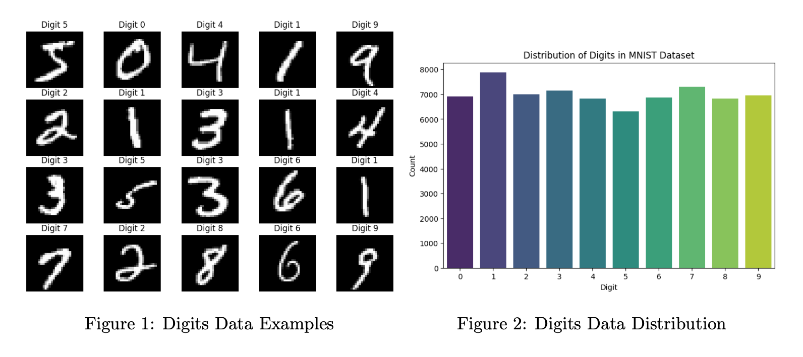
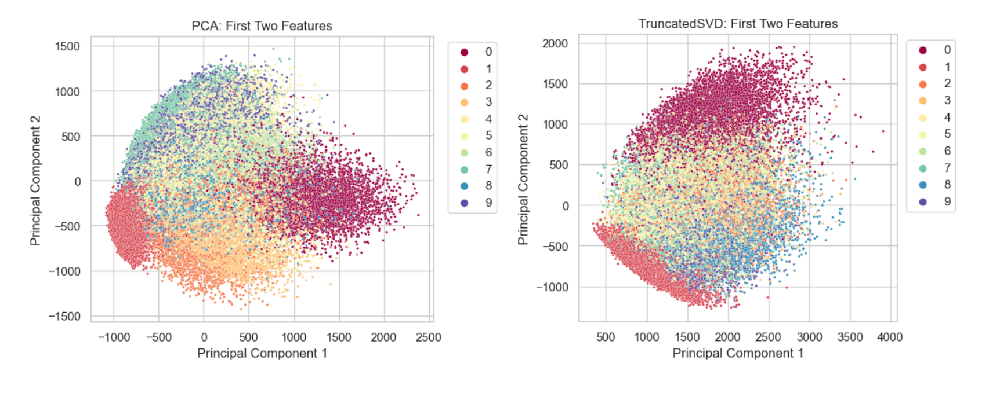
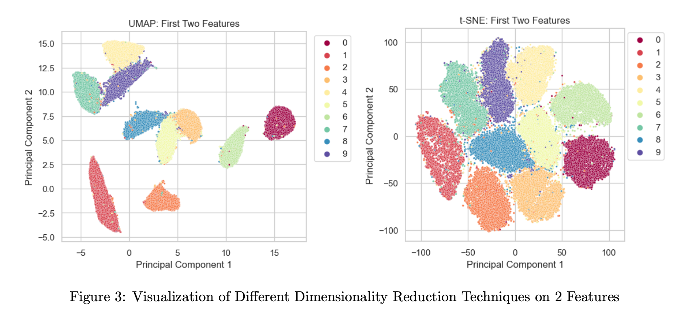
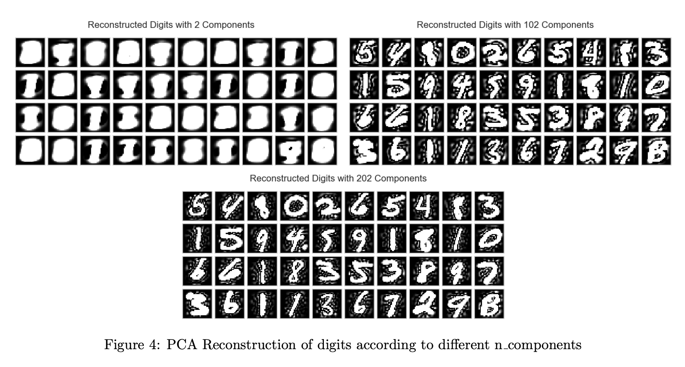
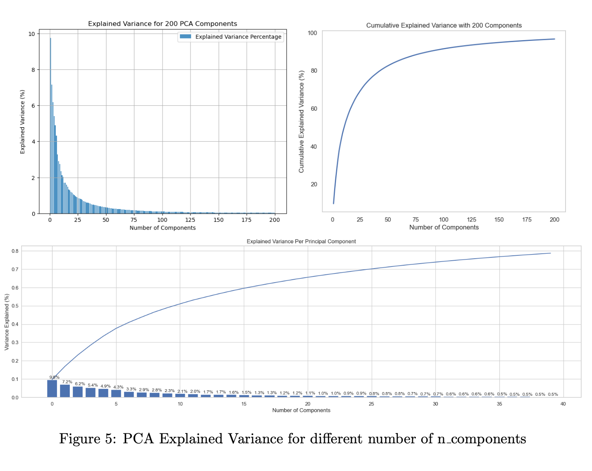
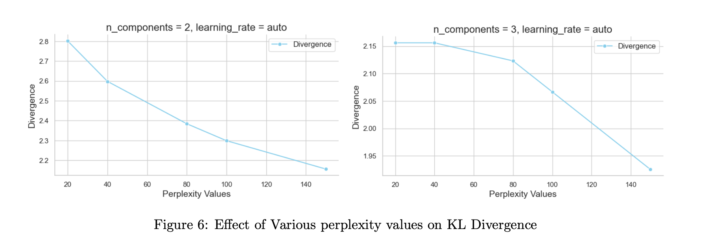

# Unsupervised Learning

Timot Baruch, Hadar Pur

Submitted as a project report for Advanced Machine Learning course, IDC, 2024

# Background, data exploration, and preprocessing

- **Dataset Overview:** The MNIST dataset comprises 70,000 images. Each image represents a single, centered, handwritten digit (0-9) and is size-normalized and grey-scaled. The images are presented as a 28x28 pixel grid, resulting in 784 features.

- **Size-Normalization and Centering:** During initial preprocessing, the dataset underwent size-normalization and centering to ensure uniformity in digit representations and simplify the learning process for machine learning models.

- **Train-Test Split:** The data was split into a training set and a test set, with the test set size set to 20% of the training set. Measures were taken to prevent overlapping writers between the two sets.

- **Data Standardization:** Despite applying StandardScaler to standardize dataset features with a mean of 0 and a standard deviation of 1, no significant enhancement in classifier performance or accuracy was observed. Consequently, the decision was made to proceed without scaling the data. Additionally, during Principal Component Analysis (PCA) for dimensionality reduction, the scaled data exhibited lower cumulative variance compared to unscaled data for a given number of components.

# Dimensionality reduction

We utilized various dimensionality reduction techniques to enhance the understanding of the MNIST dataset and visualize it in a 2-dimensional feature space. The following brief explanations outline each algorithm's role:

- **PCA (Principal Component Analysis):** PCA identifies the principal components that explain the maximum variance in the data, providing a linear projection to reduce dimensionality while retaining key information about the dataset's variability.

- **TSVD (Truncated Singular Value Decomposition):** TSVD decomposes the original data matrix into singular vectors and values, allowing for dimensionality reduction to capture dominant features and patterns in the data.

- **t-SNE (t-Distributed Stochastic Neighbor Embedding):** t-SNE is a nonlinear dimensionality reduction technique effective in revealing clusters and structures in the data while preserving pairwise similarities between data points.

- **UMAP (Uniform Manifold Approximation and Projection):** UMAP is a nonlinear dimensionality reduction method that preserves both local and global structures in high-dimensional data, capturing complex relationships within the dataset.

For all these techniques, default parameters were applied to obtain a baseline reduction, capturing essential patterns and structures within the data.

## Hyper-parameters Tuning On DR Methods

For the PCA and t-SNE methods, we conducted extensive hyperparameter testing to identify the most effective combination for optimizing performance. The key hyperparameters explored for each DR method are outlined below according to the DR used. The best run is highlighted in bold in each table.
\newline Due to exceptionally long running times, UMAP  testing was excluded from this phase of analysis. Also, TSVD provided unsatisfactory results in the visualization step, so it was excluded from this phase.

- **PCA:** he `n_components` parameter determines the number of principal components to retain. It influences the amount of variance retained in the reduced space. The `svd_solver` parameter, like 'randomized' or 'full', defines the algorithm used for singular value decomposition and impacts the computational efficiency.

| n_components | svd_solver | explained_variance | reconstruction_error |
|--------------|------------|--------------------|----------------------|
| 5            | auto       | 0.333790           | 2910.795606          |
| 5            | full       | 0.333790           | 2910.796008          |
| 5            | randomized | 0.333790           | 2910.796227          |
| 10           | auto       | 0.489385           | 2230.018559          |
| 10           | full       | 0.489385           | 2230.019752          |
| 10           | randomized | 0.489385           | 2230.018290          |
| 50           | auto       | 0.825549           | 765.217696           |
| 50           | full       | 0.825614           | 765.071916           |
| 50           | randomized | 0.825601           | 765.134985           |
| 100          | auto       | 0.914748           | 374.082438           |
| 100          | full       | 0.915059           | 373.083830           |
| 100          | randomized | 0.914669           | 374.453304           |
| 200          | auto       | 0.966205           | 148.766095           |
| **200**      | **full**   | **0.966587**       | **147.483888**       |
| 200          | randomized | 0.966184           | 148.949969           |

*Table 1: PCA Hyper-parameters tuning Results*

- **t-SNE:** The `n_components` parameter specifies the dimensionality of the embedded space. A lower value may capture global structures, while higher values might preserve more local relationships. The `learning_rate` influences the step size during optimization, affecting the convergence and final layout of the data in the low-dimensional space. The `perplexity` is a hyperparameter that balances the attention given to local and global aspects of the data. It is used to define the effective number of neighbors for each data point during the dimensionality reduction process. 

| n_components | perplexity | learning_rate | min_divergence |
|--------------|------------|---------------|----------------|
| 2            | 20         | 10            | 4.388708       |
| 2            | 20         | 200           | 3.163473       |
| 2            | 20         | auto          | 2.801678       |
| ...          | ...        | ...           | ...            |
| 2            | 150        | 10            | 2.298883       |
| 2            | 150        | 200           | 2.297647       |
| 2            | 150        | auto          | 2.156140       |
| 3            | 20         | 10            | 2.156140       |
| 3            | 20         | 200           | 2.156140       |
| 3            | 20         | auto          | 2.156140       |
| ...          | ...        | ...           | ...            |
| 3            | 150        | 10            | 2.066741       |
| 3            | 150        | 200           | 2.026015       |
| **3**        | **150**    | **auto**      | **1.925341**   |

*Table 2: t-SNE Hyper-parameters tuning Results*

